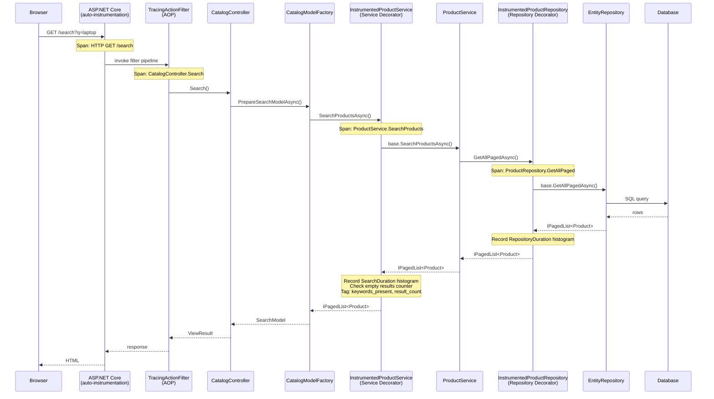
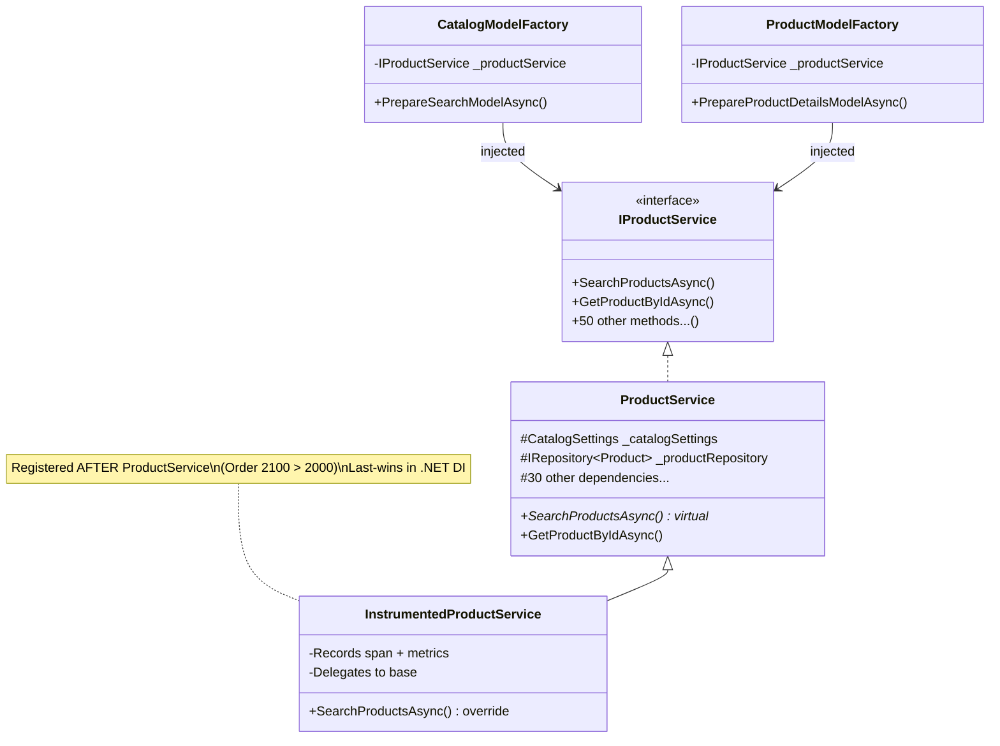
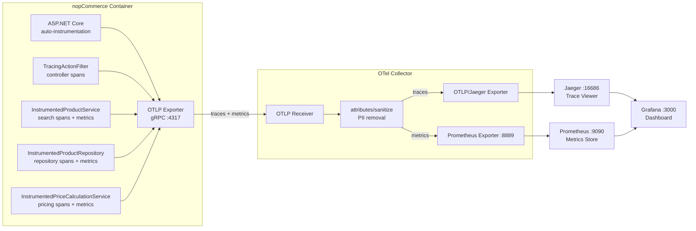

# Instrumentation: "Customer Searches and Views a Product" Flow

## Design Philosophy

**Zero changes to business logic.** All instrumentation lives in the infrastructure layer (`Nop.Web.Framework`). No service, factory, or controller file was modified.

## Design Patterns Applied

### 1. Decorator Pattern  - `InstrumentedProductService`

`InstrumentedProductService` inherits from `ProductService` and overrides only `SearchProductsAsync` to wrap it with tracing and metrics. All other methods are inherited unchanged.

**Why inheritance over interface delegation:** `IProductService` has 50+ methods. Delegating all for a single-method override would be wasteful boilerplate. Since `SearchProductsAsync` is `virtual` and all fields are `protected readonly`, inheritance gives a clean single-method override with no code duplication.

**Registration:** `OpenTelemetryStartup` (Order 2100) registers `InstrumentedProductService` as `IProductService` after `NopStartup` (Order 2000), leveraging .NET DI's last-registration-wins behavior.

### 2. AOP via Action Filter  - `TracingActionFilter`

A global `IAsyncActionFilter` registered through `MvcOptions.Filters` creates an Activity span for every controller action. This provides controller-level tracing without touching `BaseController` or any controller class.

### 3. Decorator Pattern  - `InstrumentedProductRepository`

`InstrumentedProductRepository` inherits from `EntityRepository<Product>` and overrides the key repository operations (`GetByIdAsync`, `GetAllPagedAsync`, `GetAllAsync`, `InsertAsync`, `UpdateAsync`, `DeleteAsync`) to wrap each with an Activity span and a `RepositoryDuration` histogram metric.

**Why this layer matters:** `ProductService.SearchProductsAsync` builds LINQ queries on `IRepository<Product>.Table` (an `IQueryable`), which materialises inside `GetAllPagedAsync`. Without repository-level instrumentation, the time spent inside the repository (query materialisation, caching, event publishing) is invisible  - only the aggregate service duration is captured. The repository decorator exposes this hidden layer.

**Registration:** The open-generic `IRepository<>` → `EntityRepository<>` is registered at Order 10 in `NopDbStartup`. `OpenTelemetryStartup` (Order 2100) registers the closed-generic `IRepository<Product>` → `InstrumentedProductRepository`, which takes precedence in .NET DI.

### 4. Middleware Pipeline  - `OpenTelemetryStartup`

Follows the `INopStartup` pattern used throughout nopCommerce. Responsible for:
- Registering the OpenTelemetry SDK (tracing + metrics + OTLP exporter)
- Wiring the decorators (`InstrumentedProductService`, `InstrumentedPriceCalculationService`, `InstrumentedProductRepository`)
- Adding the global action filter

### 4. Dependency Inversion Principle

The system depends on the `IProductService` abstraction. Swapping `ProductService` for `InstrumentedProductService` requires no changes to any consumer  - `CatalogModelFactory`, `ProductModelFactory`, and controllers all receive the instrumented version automatically through DI.

### 5. Separation of Concerns

All telemetry code is isolated in `Nop.Web.Framework/Infrastructure/` and `Nop.Web.Framework/Mvc/Filters/`. Business logic in `Nop.Services` and presentation logic in `Nop.Web` remain pristine.

## Diagrams

### 1. Request Flow  - Search and View Product

How a user request flows through the instrumented components:



### 2. Decorator Pattern  - DI Registration

How `InstrumentedProductService` replaces `ProductService` without changing consumers:



### 3. Observability Pipeline

Data flow from application to monitoring backends:



### 4. PII Sanitization Layers

Three layers of protection before telemetry reaches backends:

```mermaid
flowchart TD
    subgraph Layer 1  - Code
        direction LR
        L1[InstrumentedProductService]
        L1 -->|tags only| T1["search.keywords_present: true\nsearch.result_count: 42\nsearch.page_size: 12"]
        L1 -.->|never tags| X1["keywords, email,\nIP, customer data"]
    end

    subgraph Layer 2  - ASP.NET Core Defaults
        direction LR
        L2[Auto-instrumentation]
        L2 -->|captures| T2["http.method: GET\nhttp.route: /search\nhttp.status_code: 200"]
        L2 -.->|omits by default| X2["url.query, request body"]
    end

    subgraph Layer 3  - OTel Collector
        direction LR
        L3["attributes/sanitize\nprocessor"]
        L3 -->|deletes| X3["url.query\nhttp.url\nuser_agent.original\nclient.address\nnet.peer.ip\ncookie headers"]
    end

    Layer 1 --> Layer 2 --> Layer 3 --> Clean[Clean telemetry\nto Jaeger + Prometheus]

    style X1 fill:#f96,stroke:#c00
    style X2 fill:#f96,stroke:#c00
    style X3 fill:#f96,stroke:#c00
    style Clean fill:#6f6,stroke:#090
```

## Span Hierarchy

```
[auto] HTTP GET /search                        ← ASP.NET Core auto-instrumentation
  └── CatalogController.Search                 ← TracingActionFilter
       └── ProductService.SearchProducts        ← InstrumentedProductService
            │  + nopcommerce.catalog.search.duration (histogram)
            │  + nopcommerce.catalog.search.empty_results (counter)
            │  + nopcommerce.catalog.search.result_count (histogram)
            └── ProductRepository.GetAllPaged   ← InstrumentedProductRepository
                   + nopcommerce.catalog.repository.duration (histogram)

[auto] HTTP GET /product/{slug}                ← ASP.NET Core auto-instrumentation
  └── ProductController.ProductDetails          ← TracingActionFilter
       ├── PriceCalculationService.GetFinalPrice ← InstrumentedPriceCalculationService
       │      + nopcommerce.catalog.pricing.duration (histogram)
       └── ProductRepository.GetById            ← InstrumentedProductRepository
              + nopcommerce.catalog.repository.duration (histogram)
```

## Custom Metrics

| Metric | Type | Tags | Justification |
|--------|------|------|---------------|
| `nopcommerce.catalog.search.duration` | Histogram (ms) | `search.has_keywords` | Spike detection for DB query regression or search plugin timeout. The `has_keywords` tag isolates keyword-driven vs. browse-based searches. |
| `nopcommerce.catalog.search.empty_results` | Counter | `search.has_keywords` | Spike indicates catalog data deleted/unpublished, broken search index, or bot probing. Actionable: check recent catalog changes. |
| `nopcommerce.catalog.search.result_count` | Histogram | `search.has_keywords` | Tracks result set sizes. A sudden drop in average results signals catalog issues (products unpublished, broken filters). Combined with duration, reveals if large result sets correlate with slow queries. |
| `nopcommerce.catalog.pricing.duration` | Histogram (ms) | `pricing.has_discount` | Pricing is called per product on every page view. A spike means discount calculation or tier pricing logic is degrading. The `has_discount` tag isolates discount-path overhead from base pricing. |
| `nopcommerce.catalog.repository.duration` | Histogram (ms) | `db.operation` | Tracks time spent inside repository operations (query materialisation, caching, event publishing). The `db.operation` tag (GetById, GetAllPaged, GetAll, Insert, Update, Delete) isolates which operation is slow. A spike in GetAllPaged without a corresponding spike in SearchDuration points to database-level issues rather than application logic. |

## PII Protection (3 layers)

1. **Code layer:** Tags use only structural metadata (booleans, counts). Never logs keywords, emails, IPs, or customer data.
2. **ASP.NET Core instrumentation defaults:** Query strings are not captured by default.
3. **OTel Collector processor (`attributes/sanitize`):** Deletes `url.query`, `http.url`, `user_agent.original`, `client.address`, `net.peer.ip`, and `http.request.header.cookie` before export.

## Files Created/Modified

| File | Change |
|------|--------|
| `Nop.Web.Framework.csproj` | Added 3 OTel NuGet packages |
| `Infrastructure/NopTelemetry.cs` | **New**  - ActivitySource + Meter definitions |
| `Infrastructure/InstrumentedProductService.cs` | **New**  - Decorator with tracing/metrics |
| `Infrastructure/OpenTelemetryStartup.cs` | **New**  - INopStartup for OTel SDK + DI wiring |
| `Infrastructure/InstrumentedPriceCalculationService.cs` | **New**  - Decorator with pricing tracing |
| `Infrastructure/InstrumentedProductRepository.cs` | **New**  - Decorator with repository-level tracing |
| `Infrastructure/HttpPathSpanProcessor.cs` | **New**  - Custom processor for expressive trace names |
| `Mvc/Filters/TracingActionFilter.cs` | **New**  - Global action filter for controller spans |
| `otel-collector-config.yaml` | Added PII sanitization processor |
| `docker-compose.yml` | Added OTel env vars to nopcommerce_web |
| `grafana/provisioning/dashboards/` | **New**  - Dashboard provisioning + JSON |
| `loadtest/search-flow.js` | **New**  - k6 load test script |

## Files with Zero Changes

`ProductService.cs`, `PriceCalculationService.cs`, `EntityRepository.cs`, `CatalogModelFactory.cs`, `ProductModelFactory.cs`, `BaseController.cs`, all controllers, all factories, all services.

## Verification

1. `dotnet build src/NopCommerce.sln -c Release`  - compiles
2. `docker compose up --build -d`  - all containers healthy
3. Browse `/search` → trace in Jaeger at `:16686` with 3-level span nesting
4. Click product → trace with action filter span
5. Prometheus at `:9090` → custom metrics present
6. Grafana at `:3000` → dashboard panels populated
7. `k6 run loadtest/search-flow.js` → dashboard shows traffic spike
8. Jaeger traces contain no PII
